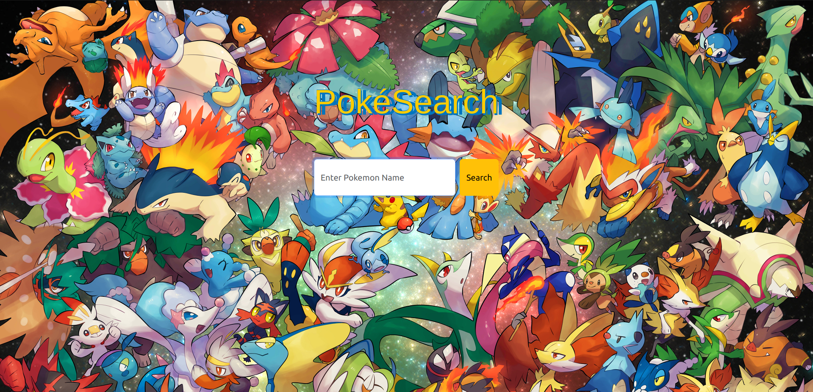

# PokeSearch

### Video Demo : [Click Here](https://youtu.be/3IfHZCVvMD8)

### Description

PokeSearch is a Pokemon Search Engine which gives the
information about the searched query(pokemon) such as height,weight, power etc.



#### Idea for the project
Frankly I'm an anime fanatic. So, I designed to build an anime related project with my newly learnt programming skills. Although, my intial ideas were completely different, such as CLI application or chrome extension,  I ended u building **PokeSearch**.

#### Journey
The learning process is exhilarating yet exciting. Intial designs of **Pokesearch** were quite enigmatic. When I jolted down every step to build this search engine, I was stuck at data fetching techniques. How can I fetch data with each search query? Build a database? File I/O? Then I came across **Pokemon ** API which is free and open source to use. Ultimately, I embeded this into my project and thus emabrked into intial steps

#### Setbacks
API's are completely new concepts. However, I attended **Global Hack Week : API WEEK** by **Major League Hacking** to learn about API's in a profound manner. This accelerated my learning and stepped up my complexity of project. SO, I learnt about **REST, FETCH, `GET`, `POST`** etc. Another major gamechanger is understanding about production level code. I have used FLask with production level code requirements.

#### File disection
Before dissection,

**Recommended** : 
1) Install a virtual environment and activate it 

```
python3 -m venv name_of_virtual_env
source name_of_virtual_env/bin/activate
```

2) Install **requirements.txt**

```
pip install -r requirements.txt
```

3) Deploy a localhost

```
flask -A myapp:create_app run
```
Now let's deep dive into every file:

`requirements.txt` 

Python dependencies used to build this project

`run.py`

This code snippet is importing a function called `create_app` from a module named `myapp`. Then, it's calling the `create_app` function and assigning its return value to a variable named app. In many Flask applications (a popular Python web framework), the `create_app` function is typically used to create an instance of the Flask application, often with various configurations set up. This pattern allows for better organization and separation of concerns within the application. So, in essence, this code is initializing the Flask application using a factory pattern.

In a typical Flask web application, these directories serve specific purposes:

`/myapp:` This directory is the root directory of your Flask application. It contains the main Python modules and packages that define the routes, views, models, and other components of your application. This is where you would typically find files like __init__.py, which initializes the Flask application and defines the routes, as well as other modules or packages that organize your application's logic.

`/myapp/static`: This directory is where you store static files such as CSS, JavaScript, images, and other assets that are served directly to the client's web browser. When you define URLs in your Flask routes that correspond to static files, Flask will automatically look for those files in this directory. For example, if you have a CSS file named styles.css, you would place it in /myapp/static/css/styles.css.

`style/styles.css`: General stylesheet used for purpose of enahncing User Interface. 

Apart from styles css **Bootstrap** components like navbar, form-control and card components are implemented in this project

``result.js`` : This JS file contains a tiny snippet that actually creates a sound event i.e pokemon cries when a cursor is dragged on the image and triggers the event.

Some image files are present in static directory

`/myapp/templates`: This directory is used for storing HTML templates that your Flask application will render and serve to clients. Flask uses Jinja2 as its template engine, and templates allow you to separate your HTML code from your Python code, making it easier to maintain and update your web application's user interface. When you render a template in your Flask routes, Flask will look for the corresponding template file in this directory. For example, if you have a template named index.html, you would place it in **/myapp/templates/index.html**.

`layout.html`

This HTML snippet defines the structure and styling for a webpage titled "PokéSearch." It imports necessary external resources such as fonts and Bootstrap libraries for styling. Additionally, it includes a custom CSS file for further styling customization. The  provides a placeholder for dynamic content to be inserted later through template inheritance.


`index.html`

This template file extends ``layout.html``. Within the overridden `main` block, it creates a webpage for the "PokéSearch" application. The body is styled with the "homepage" class. It contains a centered title, "PokéSearch", and a navigation bar. Inside the navigation bar, there's a form for searching Pokémon by name. The form submits a `POST` request to `/result` when the search button is clicked. The input field allows users to enter a Pokémon name, with autocomplete turned off and autofocus enabled for convenience. Finally, a search button styled with the "btn-warning" class triggers the search action.

`result.html`

This template also extends `layout.html` and customizes the ``main`` block. It presents a result page for the "PokéSearch" application. The body is styled with the "result-page" class. It includes a back button linking to the homepage. Card component with Bootsrap is implemented to display Pokemon info within a Card and a table.
```

  <tbody class="table-success">
                
                
                <!-- <p class="card-text"> -->
                <tr>
                    <td>{{key}}</td> 
                <td class="card-text"> {{value}}</td>
                </tr>
                <!-- </p> -->
                
                
            </tbody>

```

This above Control flow is written using **JINJA** Template engine to enable dynamic Web pages in HTML.

`__int.py__`

This Python code defines a Flask application factory named `create_app`(). It imports Flask and a blueprint named main from a module called routes. Within the factory function, it creates a Flask application instance, specifying the template folder as 'templates'. It then registers the main blueprint with the application. Finally, it returns the configured Flask application instance.
```
# if __name__ == '__main__':
#     app = `create_app`()
#     app.run(port = 8000,debug=True)
```
The commented-out block at the bottom suggests that this code was intended to run the Flask application directly if the script is executed, but currently, it's disabled. If uncommented, it would create the Flask app and run it on port 8000 in debug mode. However, in a production environment, the app might run on a different port specified by the environment variable PORT, defaulting to port 4000 if the variable is not set.

`pokeapi.py`

his Python script utilizes the requests library to interact with the ``PokéAPI`` (https://pokeapi.co/api/v2/). It defines a base URI and an **endpoint** dictionary containing the endpoint names.

The ``fetchResult`` function takes a Pokémon name as input, constructs the URL for the corresponding Pokémon data, and makes a `GET` request to the PokéAPI. If the response status code is 404 (Not Found), an empty dictionary is returned. Otherwise, the response data is processed using the `stripData` function.

The `stripData` function extracts relevant information from the JSON response and structures it into a dictionary. It capitalizes the Pokémon name and collects data such as weight, height, base experience, abilities, types, and moves. Additionally, it ensures that only the first 5 moves are included. The Pokémon's cry and picture URLs are also extracted for further use.

Overall, this script provides functions to fetch and format Pokémon data from the PokéAPI based on the provided **Pokémon** name.

`routes.py`

This Python script defines a Flask blueprint named `main`, which encapsulates routes and views for the `main `functionality of a web application. It imports the necessary modules and functions from Flask, requests, and a custom module named `pokeapi `containing the ``fetchResult`` function.

The index route handles both `GET` and `POST` requests to the root URL ("/"). It renders the "index.html" template, which likely contains a form for users to input a Pokémon name.

The `/result` route also handles both `GET` and `POST` requests. When a `POST` request is received, it extracts the Pokémon name from the form data and passes it to the `fetchResult` function to fetch the corresponding Pokémon data from the PokéAPI. If the Pokémon does not exist (resulting in an empty response), a default response with an error message and a placeholder image is created. Finally, the fetched or default response is passed to the `result.html` template for rendering.

Finally, we could say that, this script `routes.py` sets up the routing logic for the web application, allowing users to search for Pokémon and displaying the results on a separate page.
 
**LICENSE**

Including a LICENSE file in a GitHub repository is a standard practice encouraged by GitHub and open-source communities. It ensures that anyone who wants to use the code understands the terms and conditions they must follow.


#### Tech stack/Libraries

- HTML
- CSS
- Flask
- Jinja Template Engine
- API used : (https://pokeapi.co/api/v2/)

### Deployment

Deployed on [Render](https://pokesearch-mhgv.onrender.com)

### Future Plans

- **GraphQL** for convinent fetching of data and avoid redundancies
- Perform some analytics and scale it up for commericial purposes.